# Enter Tool

This module guides you on how to enter the canvas and design a project utilising various tools and entities.

## **Topics** 

- Toolbox
- Enter Canvas 
- Create Room 
- Room Settings 

### Toolbox

#### Enter Canvas Tools 

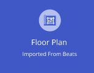  

**Floor Plan:** Use this option to upload pre-existing plans directly from BEATS.

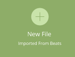

**New File:** Select this option to start a project from scratch using pre-existing templates. 

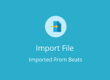

**Import File:** With this option, you can import a plan directly from previous projects.

#### Project Canvas Tools 

**Navigation Tools**

   **Area Selection Tool:** This tool is used for single or multiple module selections.

  **Move Option Tool 2D:** This allows you to relocate or move any module or group of modules in a designated direction within a room. 

  **Rotate Tool:** Used to rotate an entity in the room at any desirable angle. 

  **Views / Perspective and Parallel Tool:** This tool provides default camera angles. It also defines the parallel and perspective views of the canvas.

  **Snap Tool:** This tool will help in manoeuvrability, ensuring precise positioning of an entity adjacent to any other entity.  

**Trigger Tools**

  **Layers Tool:** Dynamic layers help hide/unhide structural entities, while catalogue layers are categorised according to room settings.

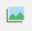  **Gallery:** Captured images are stored and can be accessed from the gallery. 

  **Lights:** To provide and add sources of illumination in the room. 

 **Settings:** Access complete room property settings. 

 **Export:** To export 2D drawings and a cut list. 

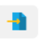 **Import:** To import files into the project. They can be in JPG format or 3D model and can be imported from an existing project. 

   **Warehouse:** This allows you to add modules and items in 3D for visualisation or quotation. 

**Design Tools**

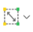  **Create Room Shape:** Create a room using predefined shapes and templates, or create a custom shape for your plan. 

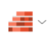 **Create Structural Entities:**  Add structural entities like columns/beams/ slabs to your floor plan. This tool allows you to alter the properties of your entity. 

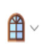 **Doors/Windows Tool:** Add doors and windows to your floor plan.

 **Undo:** Directs the user to the previous action. 

 **Redo:** Reverse or repeat a previously undone action. 

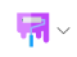 **Visualisation tool:** Adds visually appealing features like paint, wallpaper and flooring textures.

 **Measurement Tool:** Measures the distance between two points. 

 **Camera:** Captures images of the 3D, room-wise, from desired angles.

 **Environment Settings:** Adds and alters the exterior look of a project. 

 **Lit/Unlit Tool:** Provides a rendered view of the set view.

 **Text Tool:** Adds reference text in 2D or 3D canvas. 

### Enter Canvas 

To enter the canvas, the designer must undertake the following steps: 

**Step 1:** Click on the  icon to enter the canvas tool screen. 

**Step 2:** Once you have entered the canvas, you must choose from three options. 

**Namely:** Floor Plan, New File, and Import File.* 

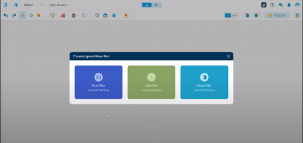

**Step 3:**  Based on your selection, for example:- To start a new project, select the ‘New File’ option to begin your journey. 

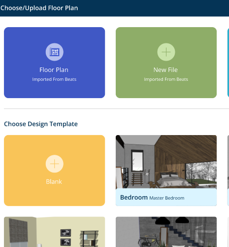

**Step 4:** Clicking on ‘Blank’ directs you to a new canvas showcasing several tool icons to start your design journey.

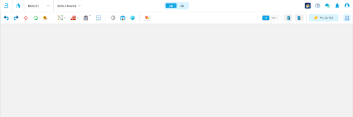

### Create Room 

This module guides you in creating a room using the tools available on your canvas.

**Step 1:** Click on the ‘Create Room’   icon. 

**Step 2:** Select from the desired shapes and template options from the dropdown menu.  
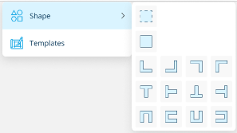

:::tip
By clicking on the custom wall option in ‘shapes,’ you can create a custom shape for the room. 

- Drag and drop the chosen shape on the canvas to start your journey.  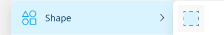
:::

**Step 3:** Select the required room type, add the Room Name, and click submit to save the room.  

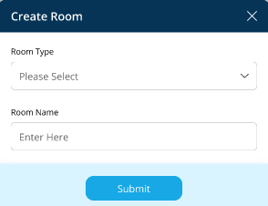

**Step 4:** Choose from 2D & 3D layouts featured on the toolbar using the toggle for preferred visualisation.* 

**2D Layout-**

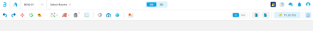

**3D Layout-**

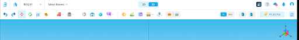

:::note
**Please note that the tool icons will vary per the selected layout.** 
:::

**For more information on the Navigation tools, refer to the TOOLBOX.**

**Step 5:** Start your design journey by clicking on the **"Structural Entities"** Tool icon

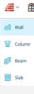

Alter the properties of the featured entities according to your preference.  
You have the option to add a Wall, Beam, Column or Slab from the dropdown menu. 

- On adding the entity, a properties bar on the right side of your screen will be visible, which allows one to add preferred dimensions and sizes. 

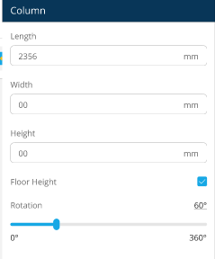

**Step 8:** Navigate towards the **"Door and Windows”** tool icon after finalising the structural entities. You may select the doors and windows' properties as per client requirements from the dropdown menu. 

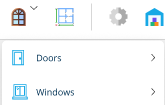

- Move the cursor to place the selected feature. 

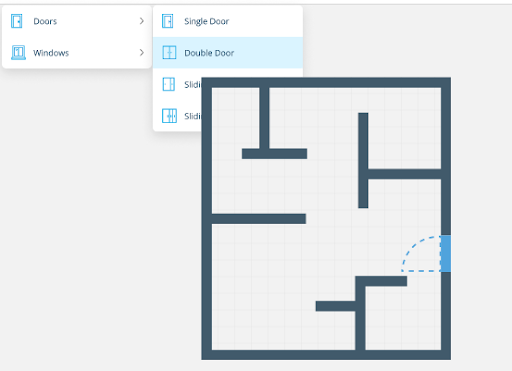

**Step 9:** You can review the room’s floor plan after establishing the structural and foundational features. 

### Room Settings 

Select and finalise the room material to be imported by defining its properties. 

**Step 1:** Click on the  icon featured on the toolbar to access room settings. 

**Step 2:** Navigate the categories based on the selected catalogue. 

**For e.g-** If the selected room type is the kitchen, its catalogue will look like this: 

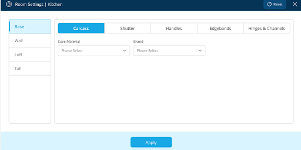

**Carcass:** Select the core material and brand from the drop-down menu along with the desired colour. 

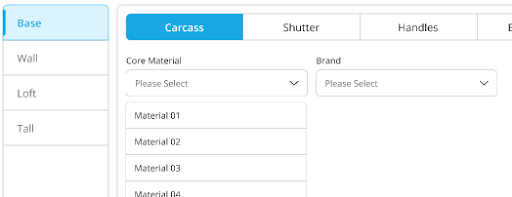

**Shutter:** Choose from the options in the dropdown menu and select the shutter colour based on the client’s preference. 

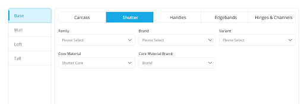

**Handles:** Decide upon the handle design and finish used for cabinets. 

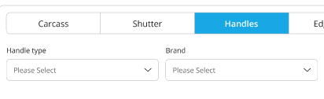

**For example,** 

**Edgebands:** Choose Edgebands from the options given below. 

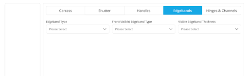

**Hinges and Channels:** Select your hinges and channels from the dropdown menu.

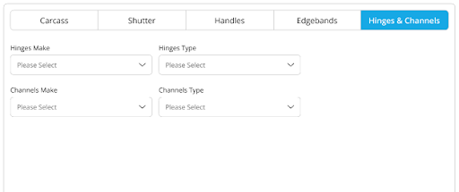

:::note
*Edgeband and Hinges are features used for a complete room, not category-wise.
:::