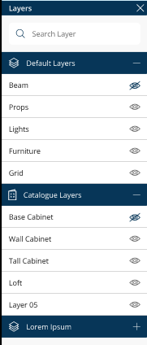
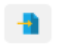
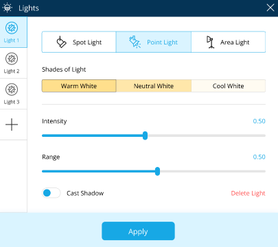
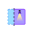
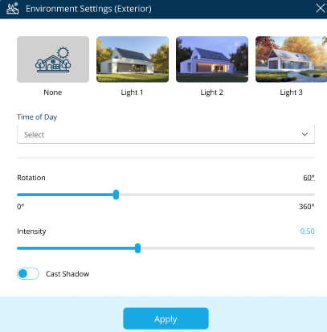
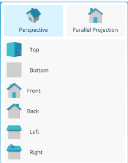
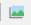
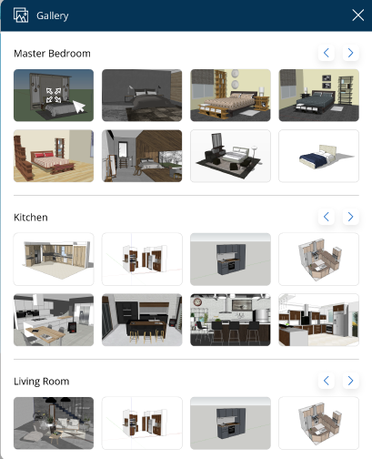

# Layers, Import, Export, Lights, Lit/Unlit

*Let us learn about tool behaviours of Layers, Import, Export, Lights and Lit/Unlit. Here, you will understand the use and requirements of the listed tools.* 

## **Topics in this module:** 

- Layers 
- Import 
- Export 
- Lights 
- Lit/Unlit
- Environment Settings 
- View
- Camera
- Gallery 

### Layers 

  
This trigger tool hides and unhides entities from the floor plan ensuring the client gets better clarity. 

**Eg. -** If the client wishes to view the kitchen design without the loft or base cabinets for increased clarity, the designer can simply hide certain layers from the design instead of deleting entities using Layers. 

### Import and Export

The import tool helps the designer add files or pre-made designs in JPG format and 3D models to the design. 

The export tool helps to export 2D drawings and cut lists. 

### Lights 

  

Or 

This design tool helps add a source of illumination to the room. From basic illumination to providing multiple light sources to achieve a more realistic view. It also gives the client a better picture of their ready room. 

Here, you get three illustration options: *Spotlights, Point Lights and Area Lights.* 

This variety of lights will focus on different designated areas. You can also select different light shades and alter the light range as well as its intensity.

### Lit/Unlit

Or 

Use this feature to enhance the 3D view of the floor plan. It can be used solely for presentation purposes, which aims to provide better lighting, colour reflection and contrasts to the current set view.  
### Environment Settings 

Environment settings are provided to alter the exterior settings of a project. Many settings, like the placement of the sun and directions, are provided to make the view more realistic to enhance the overall view. 

**E.g.**- In the case of providing a realistic view to the client, the most relevant option can be selected. Clients will be able to visualise their house in a relatable space. 

### View 

The View tool helps in providing visuals from different directions for your design or floor plan. The two options at your disposal here are: perspective for 3D view and Parallel Projection for 2D view. . 

### Camera 

A tool for capturing images and screenshots of the 3D room design from various angles/frames.

### Gallery 

The screenshots taken using the camera will be automatically stored in the gallery. The designers will have design images handy to share with clients. 

