# LogIn Dashboard

## Introduction

:::note
Welcome to BLOCKS. This go-to guide will help you enhance your design journey seamlessly. Use the guide to learn how to navigate through BLOCKS- from utilising tools for project management executing features such as colour schemes, 3D modelling, etc, to maintaining uniform client collaboration. 
:::  

Let's begin understanding this intuitive and efficient design platform. 

## Getting Started

In this module, learn how to log into BLOCKS and use the dashboard.

## Topics

- #### Logging in to BLOCKS
- #### User Profile
- #### All About the Dashboard.
- #### Navigation Bar
- #### Trigger Icons 
- #### Ongoing projects 
- #### Status Indicators 
- #### Action Buttons

### Logging in to BLOCKS

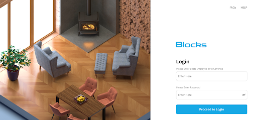

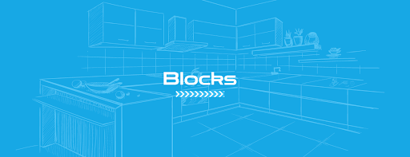

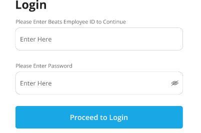

Once you open BLOCKS,  enter the following information to login: 

- **Beats Employee ID**: Enter the  Employee ID provided to you.
- **Password**: Enter the password you use to login to BEATS portal.

**In case of an issue, you can refer to the FAQs provided or reach out to us via Help from the login screen.** 

### User Profile

**The BEATS ID provided to you will be your official Username that will help keep your access unique across the app.**

### All About the Dashboard

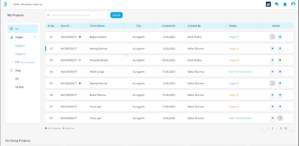

Once you’re logged in, you’ll land on the BLOCKS Dashboard—a central hub that has all the projects you are currently working on or have worked in the past. Whether you want to view BOQ, edit or work on a canvas- you can access it all from here.

### Navigation Bar 

On your left, filter through the stages of your projects by Stage 01, Stage 02 and P2P (Push to Production). 

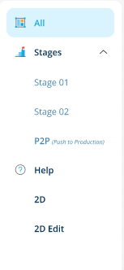

#### Blue Stage

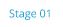

Stage 01 in blue indicates fresh leads.

#### Orange Stage

Stage 02 in Orange indicates an ongoing project that is a work in progress and open for modifications.

#### Green Stage

Green indicates that the said project has been pushed to production, and no further changes can be made to it. 

### Basic Features

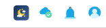

On the top right of your Dashboard, there are Basic features available for your access:

   **Dark Mode:** Use this feature to switch to Dark Mode.

  **Online Cloud:** A green tick on this cloud sign indicates that you are connected to the internet. 

  **Notification Bell:** Click on this icon to check your notifications. 

  **Designer Profile:** Click on this icon to edit your profile details or log out from your account.

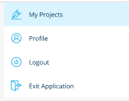

 **Search Bar:** Use this bar to search for a specific project. You can also use the INCO ID/ client name to find projects. 

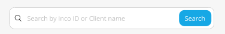

**Projects Tab:** Access the projects old/ongoing through these trigger icons. 

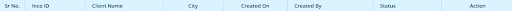

### Trigger Icons 

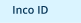  This is the INCO ID provided for each project.

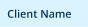  Find the client's name tagged to the INCO ID.

  The City where the project is taking place.

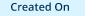  This icon showcases the lead creation date. 

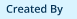  Name of the Salesperson who assigned you the project.

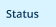  The current work stage/ status of the Project. 

### Ongoing Projects

At the bottom of your Dashboard, you can access the latest edits and projects you recently worked on with one swipe.

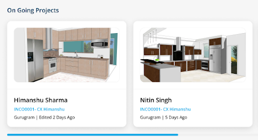

### Current Signal 

**Red Dot**  

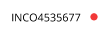

**The Red signal indicates the expiry of the PV ID.**

This is a time-sensitive action and demands the project to be immediately updated due to pricing fluctuations*. 

*Price trends on the website typically change every 3 months. 

**Green Dot**

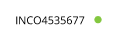

The Green Signal indicates that the file is open for modifications and add-ons. 

### Action Buttons 

**View:** 

Use this action button to access all your design versions and past creations.

**Enter Canvas:** 

Use this action button to enter the canvas. 

**Scroll Project Sheets:**

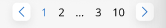

Scroll through different project pages using the arrows. 
