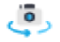

# Terminology Toolkit

## **SCALE TOOL** 

### **Overview-** 
This Navigation tool increases and decreases the size of the props or entities added to the design. 

### **Features & Functionality-** 
This tool will appear in the 3D window and work upon selection from the toolbar. Points will be provided to scale up or down in all axes to ensure relevant visualisation.  

### **Shortcut-** 
On Hover

### **Use Cases-** 
This tool is relevant when the designer needs to reshape and resize an entity added to the space for more precision. 

### **Tooltip-** 
Scaling can be done by long pressing the cursor after selecting the tool. 

## **MOVE TOOL** 

### **Overview-** 
This tool on the 3D window allows you to relocate or move module(s) in a designated direction within a room.

### **Features & Functionality-** 
The chosen entity has three axes (X, Y, Z) for movement. You can put the exact numbers/values at the bottom to move it exactly where you want.

### **Shortcut-** 
On hover 

### **Use Cases-** 
Used to relocate any module or group of modules in the desired direction. 

### **Tooltip-** 
Select the tool and add the desired value in the bar provided at the bottom 

## **DOORS/WINDOWS**

### **Overview-** 
Add doors and windows to your floor plan.

### **Features & Functionality-** 
Enabling users to select fenestration from various designs and dimensions as per their requirement within the available limit. 

### **Shortcut-** 
‘M’ Key

### **Use Cases-** 
Adding doors and windows to the design giving it a more realistic appeal. 

### **Tool Tip-** 
Doors and windows can be added to the design after selecting the area in the desired dimensions. Drag and place the door wherever required, then alter the properties as required. 

## **ROTATE**

### **Overview-** 
Used to rotate an entity in the room at any desirable angle. 

### **Features & Functionality-** 
Users can rotate modules, entities, or props according to their preferred angle once the axis is generated. Hover over the circle, available after tool selection, and press to rotate; it snaps conveniently at 15-degree intervals.

### **Shortcut-** 
‘R’ Key

### **Use Cases-** 
This feature is primarily used for creating angular walls in most cases.

### **Tool Tip-** 
Enter the exact angle/number in the bottom bar for a precise angle.

## **LAYERS**

### **Overview-** 
The dynamic layers tool on both windows helps hide/unhide structural entities, while catalogue layers are categorised according to room settings.

### **Features & Functionality-** 
Layers is a trigger tool that allows the designer to hide and unhide any design layer. 

### **Shortcut-** 
On the toolbar

### **Use Cases-** 
This tool comes in handy whenever there is a need to hide or unhide specific elements based on design needs, aiming for improved visual clarity for clients.

### **Tool Tip-** 
Selecting the tool will let the designer utilise the side window to hide and unhide an entity.

## **AREA SELECTION TOOL**             

### **Overview-** 
This tool is used for single or multiple module selections.

### **Features & Functionality-** 

### **Shortcut-**  On the toolbar

Use Cases- 

Not on tool behaviour sheet
Tool Tip- 

## **CREATE ROOM SHAPE** 

### **Overview-** 
Create a room using predefined shapes and templates, or create a custom shape for your plan.

### **Features & Functionality-** 
Create specific divisions to accommodate all potential outcomes of the wall layout.

### **Shortcut-** 
On the toolbar

### **Use Cases-** 
Create a custom room shape in different rectangular orientations available in most floor plans based on the client's requirements.   

### **Tool Tip-** 
Utilise default shapes to create a predefined layout that suits the floor plan. For unique room structures requiring continuous walls, employ the custom room feature.

## **VIEWS / Perspective and Parallel** 

or 

### **Overview-** 
This tool provides default camera angles. It also defines the parallel and perspective views of the canvas.

### **Features & Functionality-**  
After choosing, six default camera angles are available for selection to position your model. You can easily set both parallel and perspective views for all six camera angles.

### **Shortcut-** 
None

### **Use Cases-** 
To see the 3D model from various perspectives, you can adjust the viewing angle to parallel or perspective based on your needs.

### **Tool Tip-** 
The designer can choose a parallel or perspective view for any camera angle. No need to select a module; just pick a tool from the toolbar to set the canvas angle.

## **SNAP TOOL** 

  or  

### **Overview-** 
This tool will assist in manoeuvrability. It ensures precise positioning of an entity adjacent to another entity.

### **Features & Functionality-** 
Upon selection, the edges of the selected item will light up. This helps you align it positionally with another module. Hovering over other items will show their points for reference. 

### **Shortcut-** 
‘S’ Key

### **Use Cases-** 
While designing, precise placement is required without any overlapping and to avoid gaps. 

### **Tool Tip-** 
Select the module and click on the snap tool. Hover the cursor over the target entity for snapping. Use a reference point to trigger the snap; the chosen point will snap to the next selected hover point. 

## **ORBIT TOOL**

### **Overview-** 
Designs can be viewed from different angles. 

### **Features & Functionality-** 
To provide 360-degree navigation of the design. 

### **Shortcut-** 
Left Click

### **Use Cases-** 
When meeting or designing, clients can fully view the 3D design. 

### **Tool Tip-** 
This tool is tagged at the left cursor of the mouse at all times. 

## **CREATE STRUCTURAL ENTITIES**

### **Overview-** 
Add structural entities like columns/beams/ slabs to your floor plan. This tool allows you to alter the properties of your entity.

### Features & Functionality- 	

### **Shortcut-**  
On the toolbar

Use Cases- 

### **Tool Tip-** 
Add in 2D and change properties like dimensions in both 2D and 3D. Move to the desired location. 

## **VISUALISATION**

### Overview- 

### Features & Functionality- 

### **Shortcut-**
  On the toolbar

Use Cases- 

Tool Tip- 

## **MEASUREMENT** 

### Overview- 

### Features & Functionality- 

### Shortcut- 

### Use Cases- 

### Tool Tip- 

## **CAMERA**

### Overview- 

### Features & Functionality- 

### Shortcut- 

### Use Cases- 

### Tool Tip- 

## **ADD SKIRTING and COUNTERTOP**

### Overview- 

### Features & Functionality- 

### **Shortcut-****  
On the toolbar

### Use Cases- 

### Tool Tip- 

## **UNDO/REDO** 

### **Overview-** 

Undo: Directs the user to the previous action. 

Redo: Reverse or repeat a previously undone action.

### **Features & Functionality-** 

### **Shortcut-** Ctrl+Z and Ctrl+Y respectively

### Use Cases- 

### Tool Tip- 

## **ENVIRONMENT SETTINGS**

### Overview- 

### Features & Functionality- 

### **Shortcut-** On the toolbar

### Use Cases- 

### Tool Tip- 

## **LIT/UNLIT**

### **Overview-** 
To provide a rendered view of the set view

### **Features & Functionality-** 
This feature enhances the view displayed in the 3D. It can be used for presentation purposes. This aims to provide better lighting, colour reflection and contrasts to the current set view.

### **Shortcut-** On the toolbar

### Use Cases- 

### Tool Tip- 

## **TEXT** 

### Overview- 

### Features & Functionality- 

### Shortcut-

### Use Cases- 

### Tool Tip- 

## **WAREHOUSE** 

### **Overview-** 
This allows you to add modules and items in 3D for visualisation or quotation.

### **Features & Functionality-** 
This icon will make The entire catalogue visible to the user. The catalogue displayed will be based on the selected room type. 

### **Shortcut-** 
 On the toolbar

### Use Cases- 

### Tool Tip- 

## **NSD**

### **Overview-** 
Provided for modelling of elements not present in the warehouse catalogue.

### **Features & Functionality-** 
This tool provides user flexibility to model any required element from a visualisation point of view. A separate window opens up, enabling the user to create models. Basic modelling tools are provided to create 3D models. Textures can be applied to the model, which can be imported into the room.

## **GALLERY**

### **Overview-** 
Captured images are stored and can be accessed from the gallery.

### **Features & Functionality-** 
The user will click images through the camera tool. These images will be clicked by placing the camera at a particular angle in a room. Images clicked will be stored roomwise in the gallery  

### **Shortcut-** 
On the toolbar

### Use Cases- 

### Tool Tip- 

## **LIGHTS**

### **Overview-** 
To provide and add sources of illumination in the room.

### **Features & Functionality-** 
There will be up to three sources of lights provided to the user to add to their room, from which one will be the default. Users can edit its properties and choose if they would want that to be a spotlight, area light or point light. In addition to that the colour of the light can be chosen.

### **Shortcut-** On the toolbar

### Use Cases- 

### Tool Tip- 

## **SETTINGS**

### **Overview-** 
Access complete room property settings. 

### **Features & Functionality-**
 Once added to the room, the selected property can be altered on the module level. Certain fields will be frozen, which can't be changed at the module level.

### **Shortcut-** On the toolbar

### Use Cases- 

### Tool Tip- 

## **EXPORT**

### **Overview-** 
To export 2D drawings and a cultist. 

### Features & Functionality- 

### **Shortcut-** On the toolbar

### Use Cases- 

### Tool Tip- 

## **IMPORT** 

### **Overview-** 
To import files into the project. They can be in JPG format or 3D model and can be imported from an existing project.

### **Features & Functionality-** 
The user can download the cut list file based on the final model, showing all panels, cutting size details, and 2D drawings. 

### **Shortcut-** 
On the toolbar

### Use Cases- 

### Tool Tip- 

## **ADD TILES**

### Overview- 

### Features & Functionality- 

### **Shortcut-** 
On the toolbar

### Use Cases- 

### Tool Tip- 
