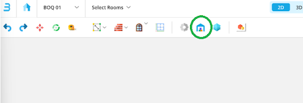
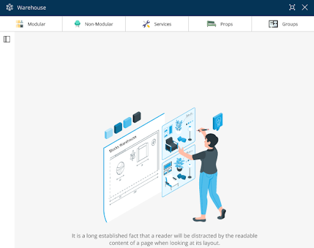
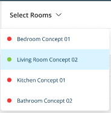
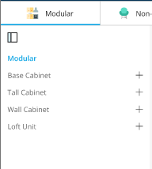
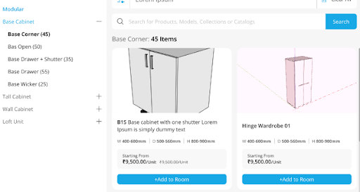
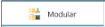
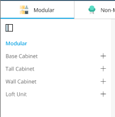
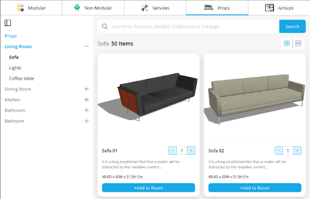
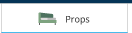
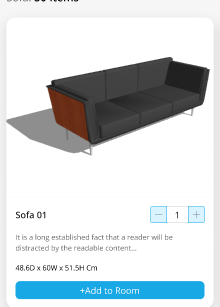

# Warehouse

*This module guides you through the warehouse of BLOCKS. Learn how to curate styles, furnishings, and accents as per the client’s requirements.* 

## Topics

- What is Warehouse? 
- [Modular ](#Modular)
  - What is ‘add to room’?  
- [Non-Modular ](#Non-Modular)
- [Services ](#Services)
- [Props](#Props)

### What is Warehouse?
The *BLOCKS* warehouse is a space icon that holds the catalogue offerings provided by Interior Company. You can access our data library through the warehouse, where assets required for any project can be easily found. 

## **Modular** 
Have to explain categories somewhere, what are categories and how are they varying as per the room type selected

@vamika.garg@squareyards.in The given example is fine, but add a different H3 for this. Update once done.

@ashi.saxena@squareyards.co.in  is this fine? kept it simple and because the categories under base cabinet are not accessible we cannot explain them with screenshots.
This category showcases all things woodwork. Upon finalising the room type, you can add modules and woodwork to the floor plan. 

### Modular Item Catalogue
The items available under the modular category depend on the room type selected by the designer, namely bedroom, kitchen or living room. 

**For Example–**

Since the room type selected here is kitchen, the properties in the drop-down menu will contain space-specific items. 

  

### What is ‘Add to Room’?

*This option allows you to add items to the canvas, which will eventually be added to your end quotation.* 

**Step 1**: Click on the ‘Modular’     icon. You will see sub-categories based on the selected room type. 

**Step 2**: Explore the product library and finalise the required item.

**Step 3**: The available products in the library can be added to your floor plan. Select the ‘+’ sign and finalise your item. 

**Step 4**: Edit the selected item's properties from the menu on the right side of your screen, and click on ‘add to room’. 

**Step 5:** The selected item will be added to your floor plan. Play around with its properties to suit your client's requirements. 
## **Non-Modular** 
Access store materials under different categories that can be added to your floor plan and the end quotation. 

These non-modular items give your client a clear vision of their space.
## **Services** 
***Overview***

We provide onsite services as a company like electrical, false ceiling or carpentry etc. These line items are the ones that you will be adding to the project based on the client's requirements. These items will not have any visualisation, but their pricing will be added to the final quotation.

## **Props** 
***Overview***                                                                                                                                       
‘Props’ is solely available for visualisation, depending on the room type. Better visualisation for the client but not for the quotation; this is primarily present to beautify the floor plan/ canvas design. 

**Add an item to the floor plan-** 

**Step 1**: Click on the ‘Props’   icon to access the props library. 

**Step 2**: A drop-down section on the left side of your screen will showcase several room choices. Select the room type, and choose the prop from the menu. 

**Step 3**: Click on ‘Add to Room’ under preferred prop to add to the floor plan.

