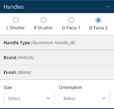
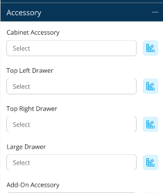
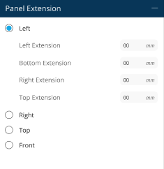

# Warehouse Property Panel

*On adding a module from the warehouse, a pop-up bar to alter the properties of an item is visible on the screen. This bar defines the ranges, materials, and accessories to generate a base costing.* 

## **Topics in this module**: 

- What is the Property Panel?
- Dimensions 
- Material 
- Handles 
- Accessory
- Panel Extension
- [How Do You Change The Properties Of An Item? ](#_mox7pyuwzygg)

### **What is Property Panel?**

Once a product or entity from the warehouse is added to the room design, a pop-up will appear on the screen. Through this, you can alter properties like dimensions, materials, and accessories of the item to generate a base costing.

### **Dimensions** 
Here, a designer can alter an item's height, width and depth in real time.  

### **Material**
The Material option will allow you to change the properties of the carcass, shutter or the visible side per the client’s requirements. The designer can choose materials brand-wise or variant-wise depending on their availability in the company's inventory. 

**E.g.-** If the client wishes to change the colour of their cabinetry, or they wish to switch the brands of the carcass box, then the materials option will come in handy. 

### **Handles** 
Here, the designer can change the hardware orientation, size orientation, shape, brand, finish, and colour. 

***\*Handles can be added and changed in Room Settings as well.*** 

### **Accessories**
Accessories are primarily used to modify the hardware and decorative pieces that are added along with your entity. 

**E.g.-** If the client wishes to view images of different hardware like handles and decides to change its properties, you can use the *Accessory* option to do the job easily without going back to room settings. 

### **Panel Extension**

If the client wishes to extend the woodwork in any space or corner in order to get a better look or cover any area, you can utilise the *Panel Extension* option to add panels in the desired space. 
### **How Do You Change The Properties Of An Item?** 

*Steps to change certain properties of any item added to the room.* 

**Step 1:** Once the item is finalised, click ‘add to room’ to edit its properties. 

**Step 2**: Alter the properties of the added entity as per the client’s requirements and click on “Add” to add the entity to your room. 

**Step 3**: The corner of your screen showcases the *Property panel* to alter the item as per your requirement. Modify the module's height, add width and height to the room design by using the *Dimensions option*. 

*Although the material for the added entity is already decided via room settings, you can alter it by making further modifications through the Materials tab.* 

**Step 4**: Click on materials, and a dropdown menu will appear featuring three options to edit. 

**E.g.-** 

**Step 5**: Click on ‘Carcass’; the drop-down will show three edit options. Choose your core material and go forward to brand and variant. 

To change the carcass colour and texture, click on ‘variant’ and choose from the options shown in the library. 

**Step 6**: Similarly, click on ‘Shutter’ and toggle between the options to change the properties of the shutter.By choosing the' Visible side' option, you can add colour to a specific side of your entity. 

**Step 7**: Modify the hardware on your woodwork using the ‘Handles’ option. Click on the drop-down and change the orientation as per your requirement. 

**Step 8**: If the client wishes to look at the accessories again, choose ‘Accessory’ from the property panel. 

**Step 9**: Click on  option to view images and change your accessories.  

**Step 10:** If the client wishes to extend the woodwork, click on ‘Panel Extension’ and choose a desired direction to add the panel. 

*While making these changes, you can view the updated costing in the top right corner.* 

